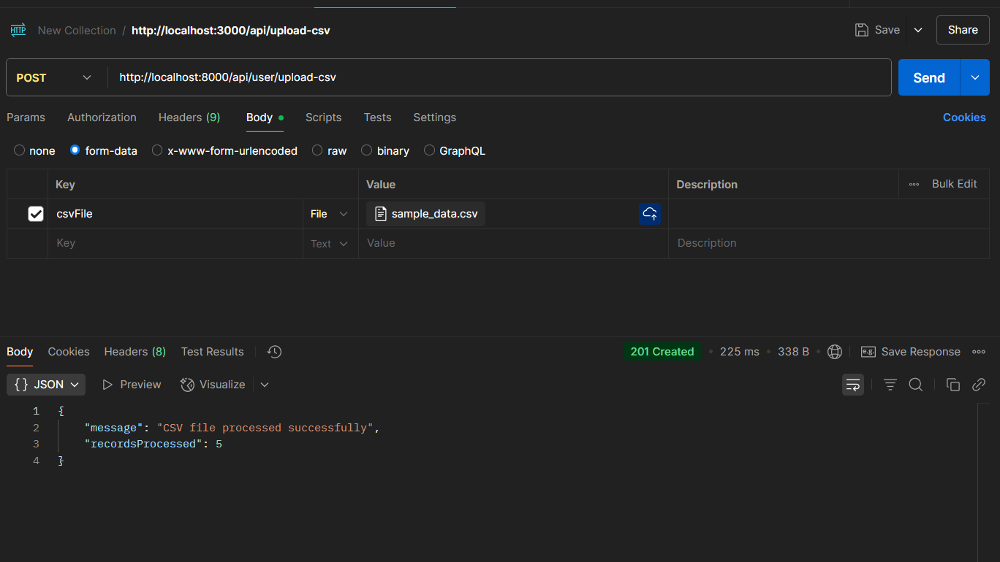
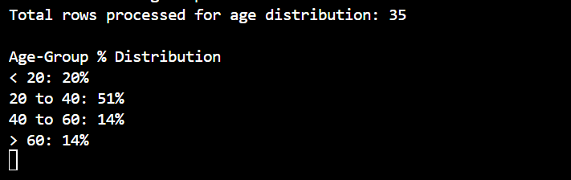
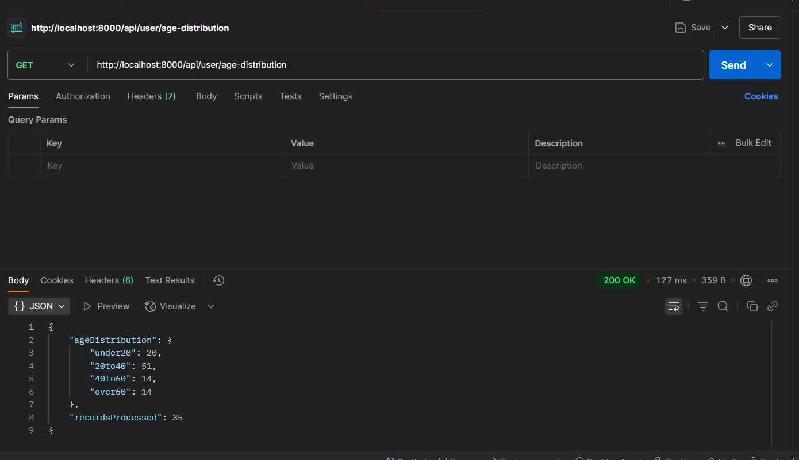
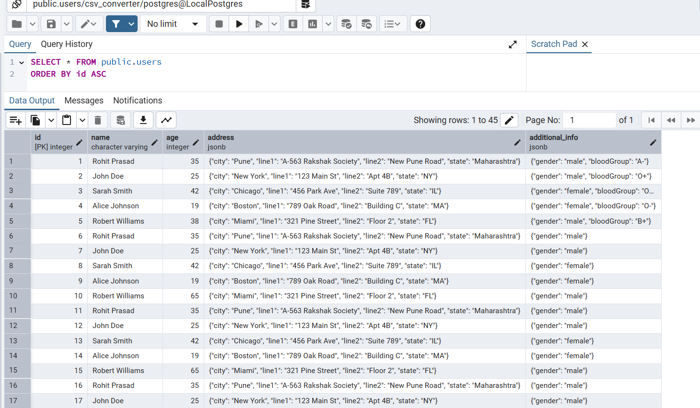

# CSV to JSON Converter API

This project is a Node.js Express backend that allows you to upload a CSV file, parses it into JSON, and stores the data in a PostgreSQL database. It also provides an API to get the age distribution of all users in the database.

## Features
- Upload a CSV file with nested/complex properties (dot notation supported)
- Stores user data in PostgreSQL, with flexible handling of additional fields
- Returns age group distribution for all users
- Robust error handling and modular codebase

## Folder Structure
```
├── src/
│   ├── config/           # Database connection and setup
│   ├── controllers/      # Route controllers
│   ├── middleware/       # Error handler middleware
│   ├── routes/           # Express route definitions
│   ├── services/         # CSV parsing and business logic
│   └── index.js          # Main server entry point
├── uploads/              # Uploaded CSV files (auto-created)
├── testdata/             # Example CSV files for testing
├── .env                  # Your environment variables (not committed)
├── .env.sample           # Sample env file for setup
├── package.json
```

## Setup Instructions

1. **Clone the repository**
   ```sh
   git clone https://github.com/Altafalam3/Kelp-Task
   cd kelp-task
   ```

2. **Install dependencies**
   ```sh
   npm install
   ```

3. **Configure environment variables**
   - Copy `.env.sample` to `.env` and update values as needed:
     ```sh
     cp .env.sample .env
     # Or manually create .env and fill in values
     ```

4. **Start PostgreSQL**
   - Make sure PostgreSQL is running and accessible with the credentials in your `.env` file.

5. **Run the server**
   ```sh
   npm run dev
   # or
   npm run start
   ```
   The server will auto-create the database and table if they do not exist.

## API Endpoints

### 1. Upload CSV and Insert Data
- **POST** `/api/user/upload-csv`
- Form field: `csvFile` (type: file)
- Accepts a CSV file and inserts records into the database.

### 2. Get Age Distribution
- **GET** `/api/user/age-distribution`
- Returns the age group distribution and number of users in the database.
- Example response:
  ```json
  {
    "ageDistribution": {
      "under20": 10,
      "20to40": 60,
      "40to60": 25,
      "> 60": 5
    },
    "recordsProcessed": 100
  }
  ```

## Demo

### 1. CSV Upload API



### 2. Age Distribution API Output





### 3. Database Table View




## Notes
- All extra fields in the CSV (not part of name, age, or address) are stored in the `additional_info` column as JSON.
- The `uploads/` directory is auto-created if it does not exist.
- Error handling is centralized via middleware.
